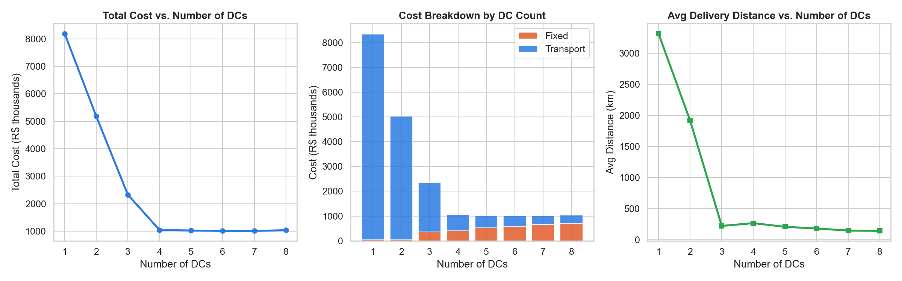
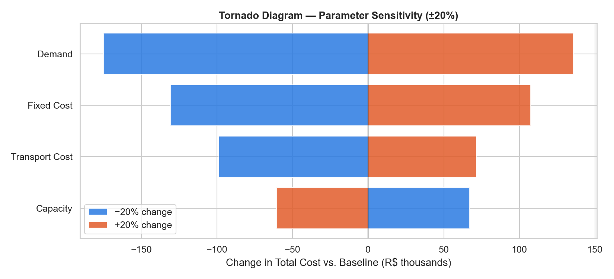
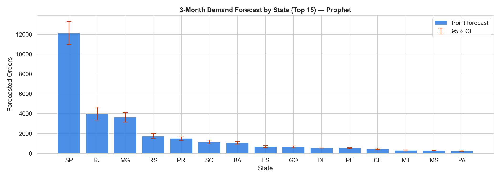
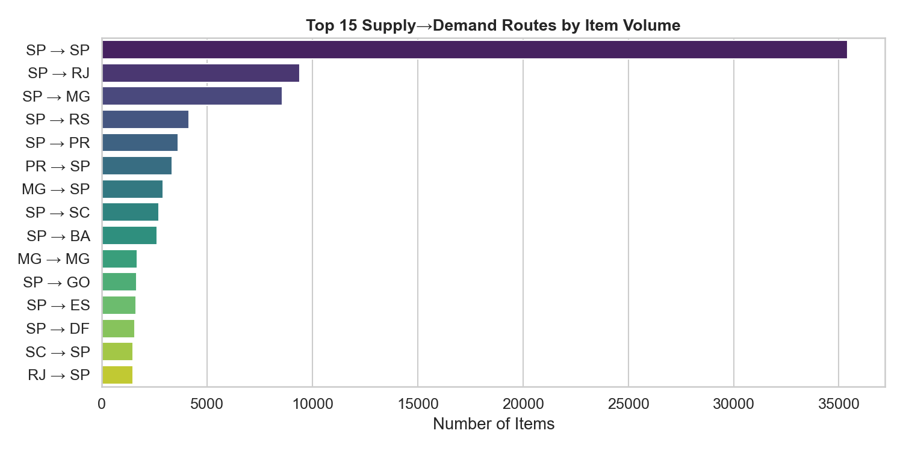

# 🏭 Supply Chain Network Design — Brazilian E-Commerce

> **End-to-end data science project** combining demand forecasting, mathematical optimization, and interactive visualization to design an optimal distribution network for Brazilian e-commerce logistics.


---

## 📌 Project Overview

This project addresses a real-world **Supply Chain Network Design** problem: given customer demand spread across 27 Brazilian states, where should distribution centers (DCs) be opened to **minimize total logistics cost** while satisfying all demand?

The project is built as a complete data science pipeline — from raw transactional data to a live interactive dashboard — using the [Olist Brazilian E-Commerce Dataset](https://www.kaggle.com/datasets/olistbr/brazilian-ecommerce).

### Problem Formulation

The optimization problem is modelled as a **Capacitated Facility Location Problem (CFLP)**:

$$\min \sum_{j \in J} f_j y_j + \sum_{i \in I} \sum_{j \in J} c_{ij} x_{ij}$$

Subject to:
- **Demand satisfaction**: $\sum_j x_{ij} \geq d_i \quad \forall i \in I$
- **Capacity**: $\sum_i x_{ij} \leq K_j y_j \quad \forall j \in J$
- **Linking**: $x_{ij} \leq d_i y_j \quad \forall i,j$
- **Integrality**: $y_j \in \{0,1\}, \quad x_{ij} \geq 0$

Where $y_j$ = DC open/close decision, $x_{ij}$ = order flow, $d_i$ = forecasted demand, $f_j$ = fixed opening cost, $c_{ij}$ = transport cost per order.

---
Link to dashboard:https://suply-chain-network-design-2zfcwmtuvb3c5pmbzswrrg.streamlit.app/
## 🗂️ Repository Structure

```
supply-chain-network-design/
│
├── data/                          ← Raw Olist CSVs (download from Kaggle)
│   ├── olist_orders_dataset.csv
│   ├── olist_order_items_dataset.csv
│   ├── olist_customers_dataset.csv
│   ├── olist_sellers_dataset.csv
│   ├── olist_products_dataset.csv
│   ├── olist_order_payments_dataset.csv
│   ├── olist_order_reviews_dataset.csv
│   ├── olist_geolocation_dataset.csv
│   └── product_category_name_translation.csv
│
├── outputs/                       ← Generated by notebooks (auto-created)
│
├── phase1_data_engineering.py     ← Data pipeline & EDA
├── phase2_demand_forecasting.ipynb ← SARIMA / Prophet / LightGBM
├── phase3_milp_optimization.ipynb ← CFLP formulation & analysis
├── phase4_dashboard.py            ← Streamlit interactive dashboard
│
├── requirements.txt
└── README.md
```

---

## 🔬 Methodology

### Phase 1 — Data Engineering
- Merged all 9 Olist tables into a unified analytical dataset (~96k order items)
- Engineered features: delivery delay, actual delivery time, product volume, revenue
- Aggregated demand and supply nodes at the state level (27 Brazilian states)
- Built a **Haversine distance matrix** between all state centroids
- Generated geospatial visualizations using Folium

### Phase 2 — Demand Forecasting
Three models were trained and compared on a 3-month hold-out test set:

| Model | Approach | Avg MAPE (focus states) |
|-------|----------|------------------------|
| SARIMA | Per-state classical time series | ~27% |
| Prophet | Per-state trend + seasonality | ~102% |
| **LightGBM** | **Global model with lag & calendar features** | **~12%** ✅ |

**LightGBM was selected** as the point forecast model due to its consistent superiority across all states. Prophet confidence intervals were retained as uncertainty bounds for stochastic scenario analysis.

Key features used: lag-1/2/3/6, rolling mean/std (2–3 months), month, quarter, month sin/cos encoding, state encoding.

### Phase 3 — MILP Optimization
- Formulated as a **Capacitated Facility Location Problem** and solved with **PuLP / CBC**
- 27 demand nodes, 27 candidate DC locations (Brazilian state capitals)
- Transport costs derived from Haversine distances × calibrated cost-per-km
- Fixed opening costs tiered by city size (R$40k–R$150k/month)

**Key results:**

| Analysis | Finding |
|----------|---------|
| Baseline optimal | **6 DCs** → R$1,011,446 total cost, 182 km avg distance |
| Elbow point | **4 DCs** → R$1,047,485 (only 3.6% more expensive, saves R$170k fixed) |
| Optimal locations | SP, RJ, MG, SC, SE, PI |
| Biggest cost driver | **Demand** (tornado analysis, ±20% → R$310k range) |

**Scenario analysis** (4 DCs, Prophet 95% CI bounds):

| Scenario | Total Cost | Open DCs |
|----------|-----------|---------|
| Pessimistic | R$915,065 | MG, SC, SE, SP |
| Baseline | R$1,047,485 | MG, PR, SE, SP |
| Optimistic | R$1,325,650 | BA, RJ, SC, SP |

### Phase 4 — Interactive Dashboard
Built with **Streamlit + Plotly + Folium**, deployed with live MILP re-solving on slider change.

Features:
- 🗺️ Interactive network map with flow lines and demand heatmap
- 📊 Sensitivity curves (cost vs. DC count, avg distance, cost breakdown)
- 🎯 Scenario comparison with demand uncertainty bands
- 🌪️ Tornado diagram for parameter sensitivity
- 📈 National trend + per-state demand time series

---

## 📊 Key Visualizations

| | |
|---|---|
|  |  |
| *Sensitivity: cost & distance vs. DC count* | *Tornado: cost sensitivity to ±20% parameter changes* |
|  |  |
| *3-month demand forecast with 95% CI* | *Top supply→demand flow routes* |

---

## 🚀 Getting Started

### 1. Clone the repository
```bash
git clone https://github.com/YOUR_USERNAME/supply-chain-network-design.git
cd supply-chain-network-design
```

### 2. Install dependencies
```bash
pip install -r requirements.txt
```

### 3. Download the data
Download the [Olist dataset from Kaggle](https://www.kaggle.com/datasets/olistbr/brazilian-ecommerce) and place all 9 CSV files in the `data/` folder.

### 4. Run the pipeline
```bash
# Phase 1 — Data engineering (generates outputs/)
python phase1_data_engineering.py

# Phase 2 — Demand forecasting (run in Jupyter)
jupyter notebook phase2_demand_forecasting.ipynb

# Phase 3 — MILP optimization (run in Jupyter)
jupyter notebook phase3_milp_optimization.ipynb

# Phase 4 — Launch dashboard
streamlit run phase4_dashboard.py
```

---

## 📦 Requirements

```
pandas
numpy
matplotlib
seaborn
geopandas
folium
statsmodels
prophet
lightgbm
scikit-learn
pulp
streamlit
streamlit-folium
plotly
pyarrow
scipy
```

---

## 💡 Technical Highlights

- **Operations Research + ML hybrid**: The project bridges classical MILP optimization (OR background) with modern ML forecasting — a rare combination in data science portfolios
- **Global LightGBM model**: Training across all 27 states simultaneously compensates for short per-state time series (only 24 months of data), achieving 2–6% MAPE on key states
- **Stochastic demand handling**: LightGBM point forecasts feed into the MILP objective; Prophet 95% CIs define pessimistic/optimistic scenarios without adding stochastic programming complexity
- **Live re-optimization**: The Streamlit dashboard re-solves the MILP in real time when the DC count slider changes, enabling true interactive scenario exploration
- **Robust problem formulation**: Service-level constraints (max 3,500 km per route), capacity constraints, and linking constraints all encoded explicitly in the MILP

---

## 📁 Dataset

**Brazilian E-Commerce Public Dataset by Olist**
- Source: [Kaggle](https://www.kaggle.com/datasets/olistbr/brazilian-ecommerce)
- Period: September 2016 – August 2018
- Scale: ~96,000 delivered order items across 27 Brazilian states
- 9 relational tables: orders, items, customers, sellers, products, payments, reviews, geolocation, categories

---

## 👤 About

Built as a portfolio project for a **Master's in Applied Statistics & Probabilities** (M2), targeting Data Scientist roles in logistics, consulting, and e-commerce analytics.

**Skills demonstrated**: data engineering, geospatial analysis, time series forecasting, MILP formulation & solving, sensitivity analysis, stochastic scenario modelling, interactive dashboard development.

---

## 📄 License

MIT License — free to use, adapt, and build upon with attribution.
